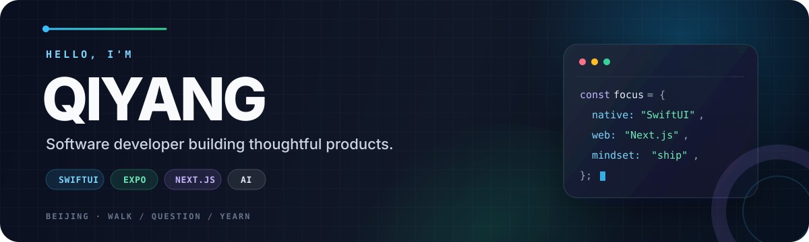

  

  
  
  

## Build thoughtfully. Ship practically.

I'm Qiyang, a software developer in Beijing. I turn ideas into focused products across Apple platforms and the web, working mostly with **SwiftUI**, **Expo**, **Next.js**, and **AI-native workflows**.

I care about calm interfaces, small systems that age well, and tools that make complicated work feel simple.

## Current direction

- **Building** polished native and cross-platform product experiences.
- **Exploring** AI-assisted workflows, local-first software, and developer tools.
- **Writing** notes about engineering and product craft on [my blog](https://blog.qiyang.dev).

## Toolbox

  
  
  
  
  
  
  

## Let's connect

If you're working on native apps, AI products, developer tools, or a thoughtful web experience, I'd love to hear about it. Reach me at **[wangqiyangx@gmail.com](mailto:wangqiyangx@gmail.com)**.

  Walk · Question · Yearn

